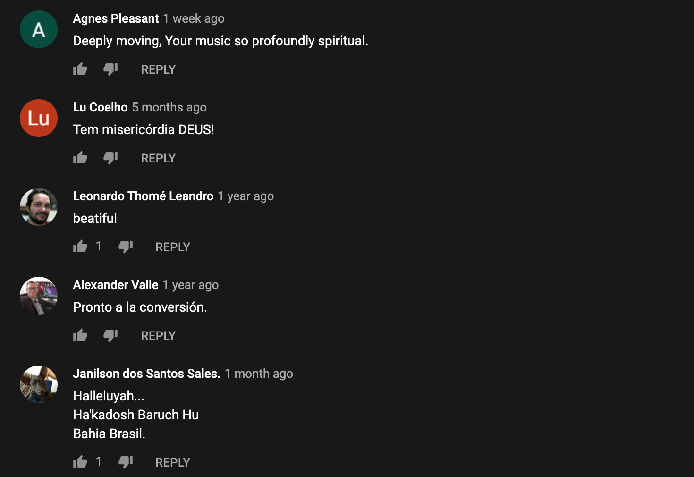
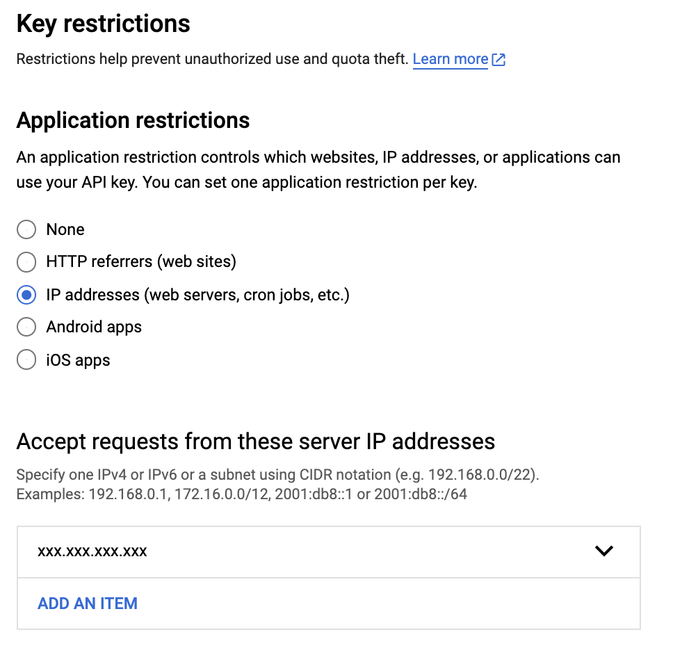
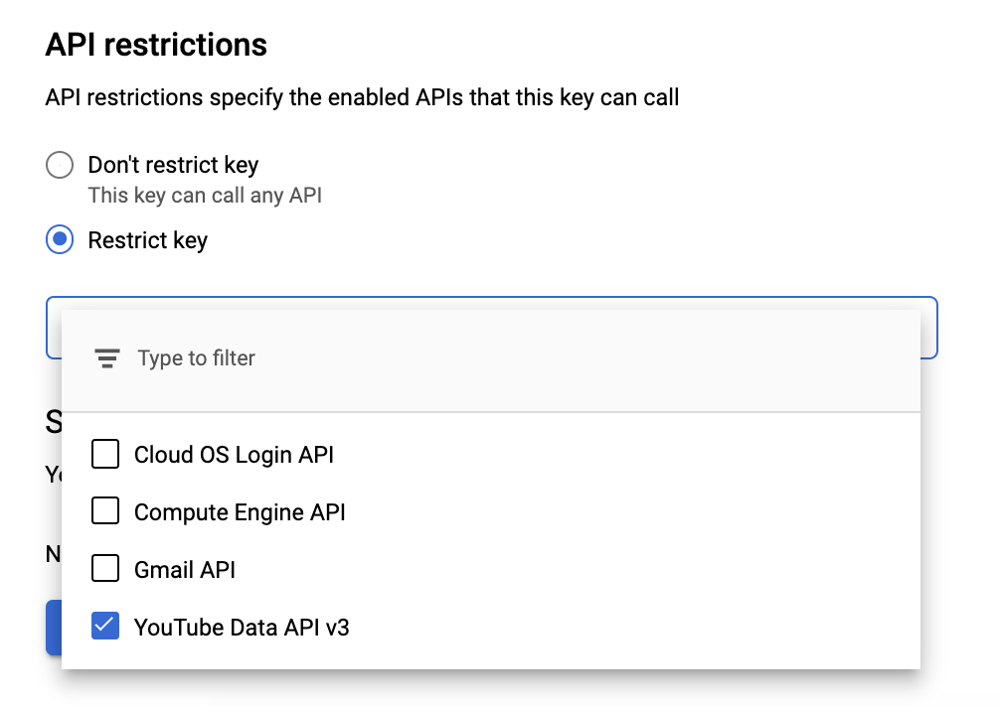
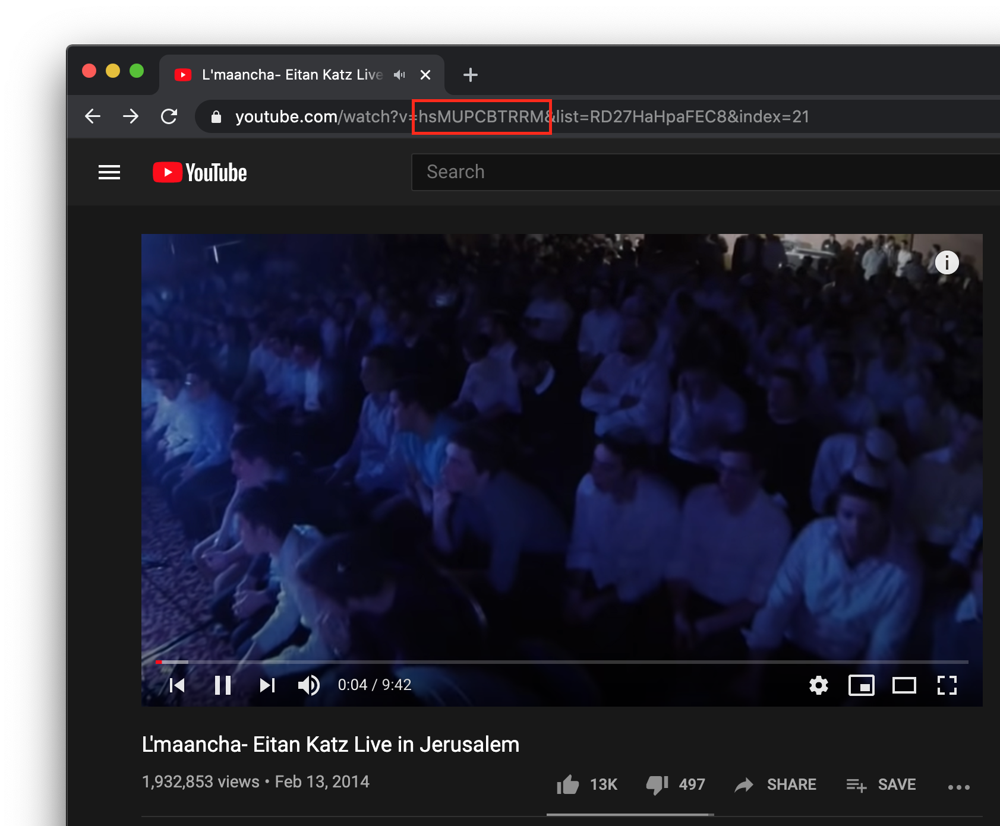
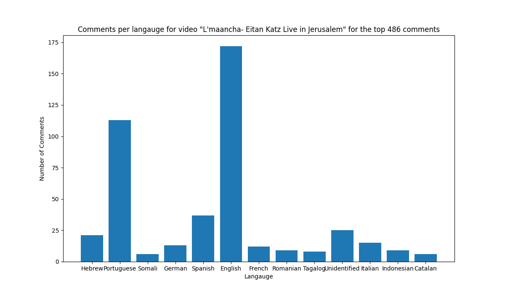
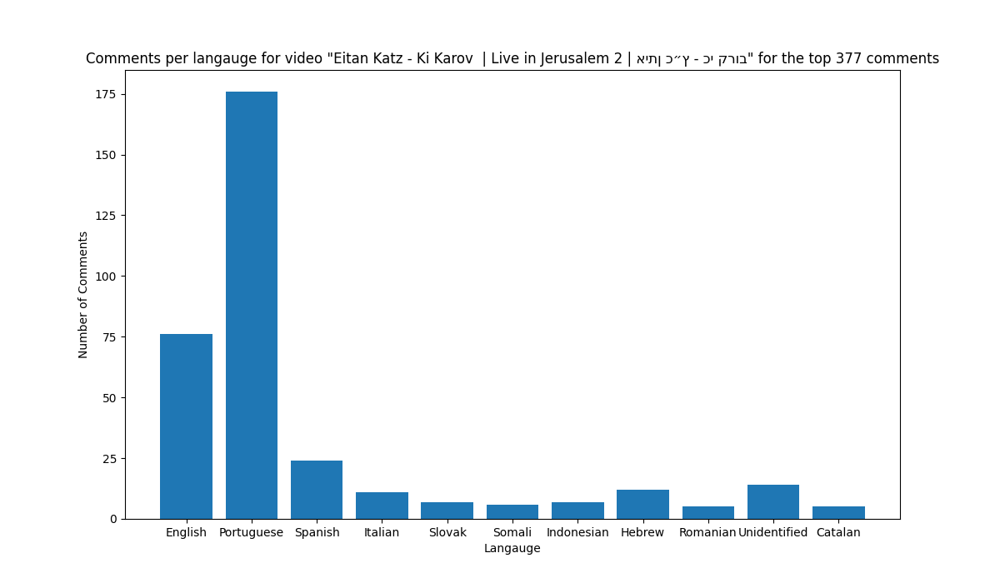
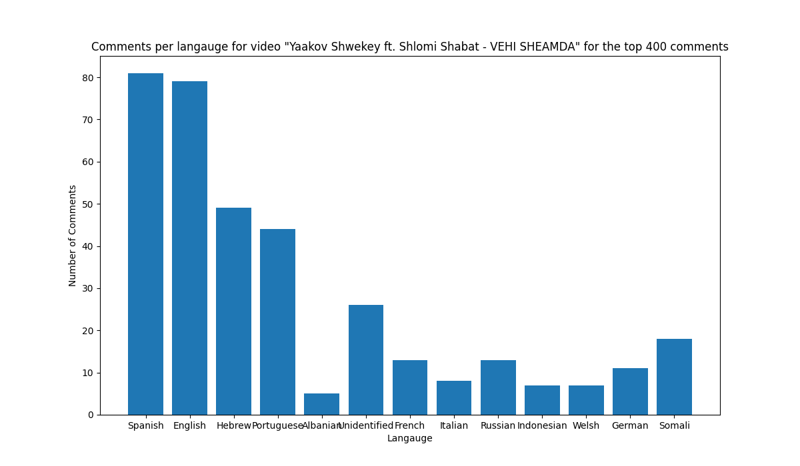
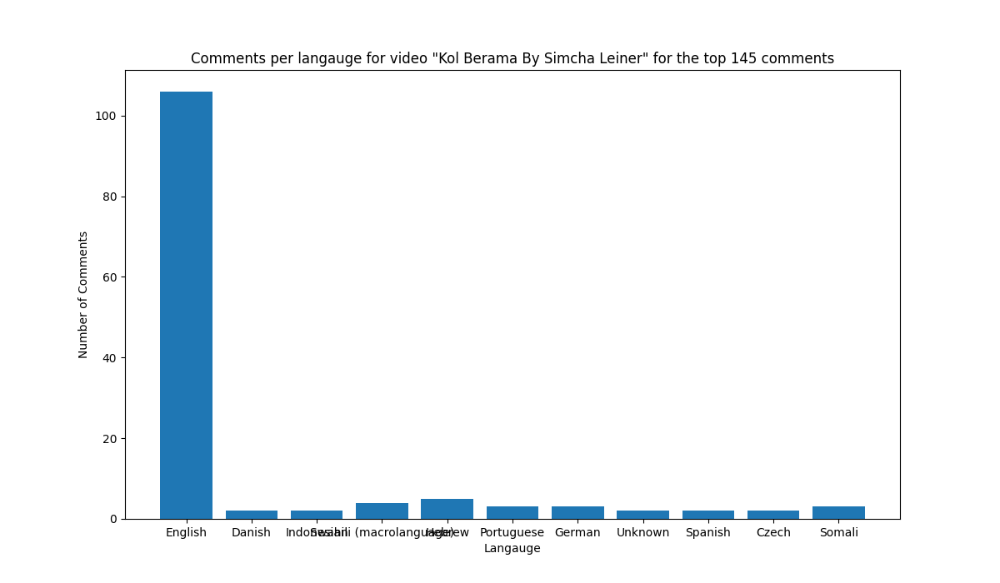
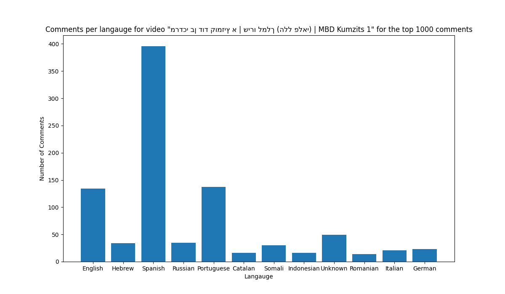

# SfatKolHaaretz

For anyone who grew up in the Modern Orthodox community, you know this type of music. It's the type you sang in camp in the last few hours of Shabbat. It's the type that's sung over and over and over again to Lecha Dodi by every chazzan who thinks they're original by using L'maancha. It's the type that that insufferable friend won't stop harmonizing too because the chord structure is usually pretty basic.

It's slow Jewish music.

Now some of us enjoy listening to this music, even though it gets very repetitive very quickly. I happen to be one of those people. Recently I was listening to some Jewish music on YouTube, and I happened to scroll down to the comments section. Expecting to find Teaneck grandmothers commenting "Beautiful!!! Long live Israel! 🇮🇱🇮🇱🇮🇱", I was surprised to find that a lot of the comments seemed to be in Latin languages.


_Some comments from Eitan Katz's [Lmaancha](https://www.youtube.com/watch?v=c08WY2MNCH8)_

Surprised that Eitan Katz's L'maancha seemed to be so popular in Southern America, I tried to find a way to visualize this phenomnenon. And thus SfatKolHaaretz was born.

SfatKolHaaretz uses YouTube's API and [langdetect](https://pypi.org/project/langdetect/) to pull comments from a given video and then plots the number of comments by language.

## Installation

Requires Python3. Install using the requirements in `requirements.txt`.

```bash
pip install -r requirements.txt
```

## Usage

SfatKolHaaretz is run by running `driver.py` with command line arguments.

```bash
driver.py [-h] --api-key API_KEY --video-id VIDEO_ID [--num NUM] [--threshold THRESHOLD] [--outfile OUTFILE]
```

These are the command line arguments `driver.py` takes:

| tag           | purpose                                                                                    |
| ------------- | ------------------------------------------------------------------------------------------ |
| `-h`          | Display help                                                                               |
| `--api-key`   | YouTube API key. See below for details.                                                    |
| `--video-id`  | YouTube video ID. See below for details.                                                   |
| `--num`       | Maximum number of comments to process. Defaults to 100.                                    |
| `--threshold` | Minimum number of comments per language to graph. Defaults to `num / 75`.                  |
| `--outfile`   | Image file to write to. If not specified, `pyplot` will display the graph in a new window. |

### YouTube API Key

SfatKolHaaretz requires a YouTube API key to pull comments from a video.

1.  Visit the [YouTube credentials page](https://developers.google.com/youtube/registering_an_application).
2.  Click `Create Credentials` and then `API Key`
3.  Optionally restrict the API key for greater security.
    - IP addresses should enabled, with your computer's Global IP set to accept requests.
    - YouTube Data API v3 should be enabled.
      IP Settings | API Settings
      ---|----
       |

### YouTube Video ID

To obtain an ID from a YouTube video, navigate to that video and look at the URL. In the URL you will see `watch?v=<ID>`. We want to pull out that ID. Note that there may be other arguments to the URL, we only need the one following `v=` until and not including the next `&`.  
For example, the video ID for [L'maancha](https://www.youtube.com/watch?v=hsMUPCBTRRM) (#HeilegeBeisMedrish), is `hsMUPCBTRRM`


# Results

Now you might be wondering, what were the results of this little experiment?
As it turns out, [L'maancha](https://www.youtube.com/watch?v=hsMUPCBTRRM)'s comments are about a quarter Portuguese. I guess Eitan Katz is really popular in Brazil.


[Ki Karov](https://www.youtube.com/watch?v=Xh8J2YQUb_E) has more Portuguese comments than English ones!


By contrast, Yaakov Shwekey's [Vehi Sheamda](https://www.youtube.com/watch?v=qnnKFpiP1hs) has a large volume of Spanish comments.


Simcha Leiner seems to not have spread south of the border though, as evidenced by [Kol Berama](https://www.youtube.com/watch?v=Ri4-YtnNdII)'s high volume of English comments.


But swinging back to Latin America, MBD's rendition of [Ve'ata Banim](https://www.youtube.com/watch?v=nCbTQZNWpns) has far more Spanish comments than English ones!

